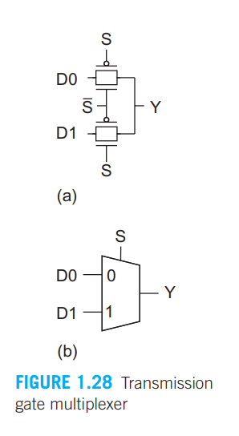
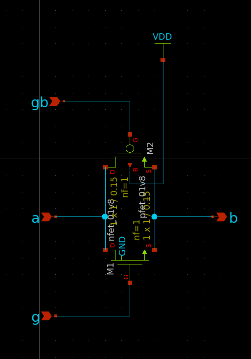
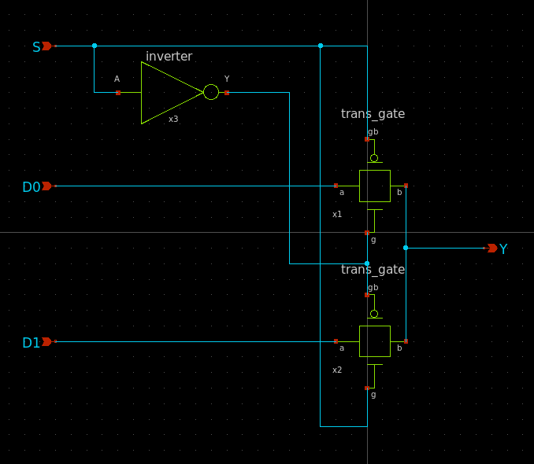
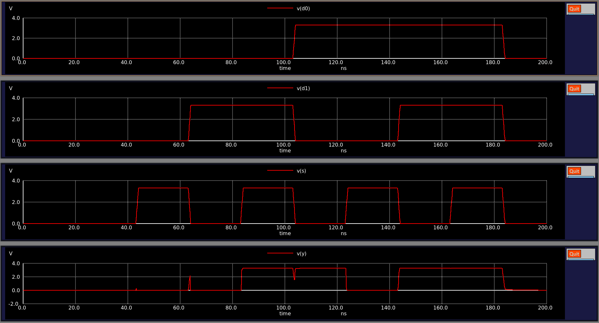

# Skywater 130A CMOS 2-1 MUX

## Introduction

This project implements a simple 2-to-1 Multiplexer using Skywater 130A PDK's technology,
following the principles of CMOS VLSI design from the book ["CMOS VLSI Design: 
A system's perspective" by Neil Weste and David Harris](https://www.amazon.com/CMOS-VLSI-Design-Circuits-Perspective/dp/0321547748).

This project's goal, was to familiarize myself with CMOS design, AMS simulation with open source tools (ngspice, verilator, xschem, skywater130 pdk).

We start by designing the circuit in xschem, then create a stimulus generator in verilog.

In the end, using a spice testbench that instantiates the verilog stimulus generator, we interface the verilog stimulus generator with our device (the mux), simulate it in ngspice, and observe the results from the applied stimulus.

Tools used:

- xschem 3.4.5
- ngspice-43
- verilator 5.026
- [Skywater 130A](https://github.com/google/skywater-pdk)

## The Circuit

The intended circuit is a 2-to-1 mux, that uses transmission gates as seen in the image
below (source: Weste and Harris' book).



### Transmission Gate

The main building block of the mux circuit is the transmission gate. This circuit takes advantage of both nMOS and pMOS operation, by outputting strongly driven 0's (from the nMOS), and strongly driven 1's (from the pMOS).
This is because nMOS devices `True` level is always less than $V_{DD}$, but `False` passes a voltage very close to the GND power rail. The opposite is the case for the pMOS device.

To design a transmission gate circuit with the Skywater130 PDK, 2 MOS devices were chosen:

- nfet 01v8 (1.8v logic nMOS)
- pfet 01v8 (1.8v logic pMOS)

They are connected 'parallel' to each other, in the following way:


## 2-to-1 MUX

We now build our 2-to-1 mux, by connecting transmission gates' gate pins,
to the select pin of the mux. A basic CMOS circuit was used to generate the inverted 'S' signal, that connects to x1's 'g' and x2's 'gb'.


---

## The Mixed Signal simulation

To simulate our DUT (the 2-to-1 mux), we generated a SPICE netlist of the circuit with xschem. 

We then wrote a verilog signal generator, with the goal stimulating our
DUT.

```verilog
// stim_gen.v
module stim_gen(
  input wire clk,
  input wire rst,
  output reg d0,
  output reg d1,
  output reg s
);

    reg [2:0] arr;
        
    always @(posedge clk) begin
        if (rst) begin
            arr <= 3'b000;
        end else begin
            arr <= arr + 3'b001;
        end

        {d0, d1, s} <= arr;
    end

endmodule

```

This generator recieves clock and reset signals from the SPICE testbench,
there instantiated like shown below:

```text
Vclock clock 0 PULSE(0 1.8 0 1n 1n 10n 20n)
Vreset reset 0 PULSE(0 1.8 0 1n 1n 10n 0)
```

Then the stim_gen module generates a "truth table" to stimulate the DUT.

### Mixed signal simulation with ngspice

To employ mixed-signal simulation, the `stim_gen.v` module needs to be 'verilated' using ngspice's script 'vlnggen':

``` bash
$ ngspice vlnggen stim_gen.v
```

then the resulting shared library `stim_gen.so` from the 'verilation' is used to instantiate the generator in the spice testbench:

```text
ahdldevice [clock reset] [d0 d1 s] null dmod
.model dmod d_cosim simulation "./stim_gen.so"
```

`ahdldevice` instantiates the stim_gen module, and interfaces it with the circuit.

## Simulation

We then simulate our testbench netlist `testbench.cir`, giving us the following results:



Which is the desired behaviour for a 2-to-1 MUX. However, it's worth noting that the voltage levels for `True` weren't the expected 1.8, but rather 3.3V. Running the maximum function on the d0 stimulus node, we get a voltage of 3.3V. 
```
ngspice 5 -> print maximum(v(d0))
maximum(v(d0)) = 3.300000e+00
```

The manual doesn't note any parameters for `d_cosim` that would specify low and high voltage levels, instead defaulting to 3.3V.